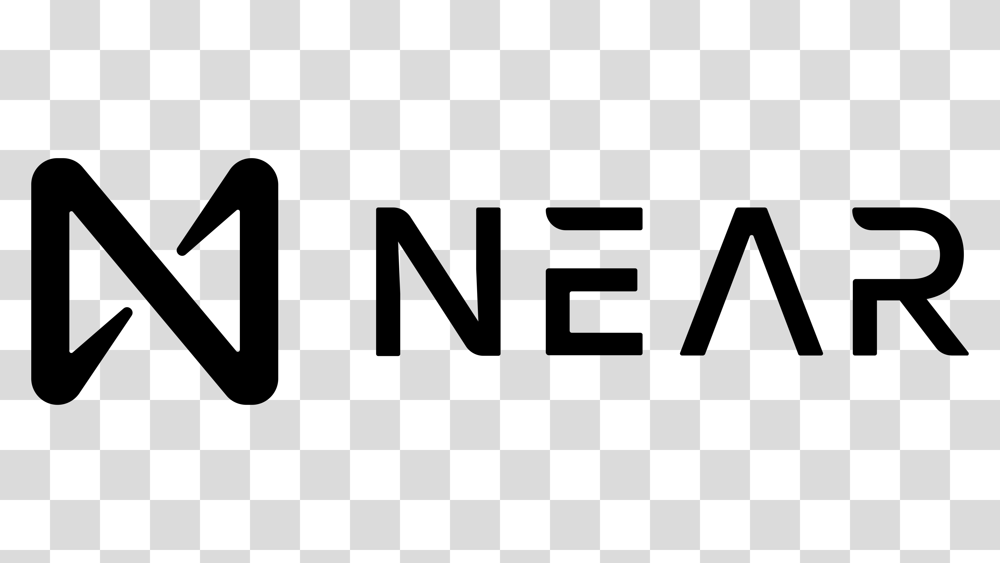

## Experienced Blockchain Networks

<table>
  <tr>
    <td align="center" width="96">
        
       Internet Computer
    </td>
    <td align="center" width="96">
      
        
      
       Solana
    </td>
    <td align="center" width="96">
      
        
      
       Ethereum
    </td>
    <td align="center" width="96">
      
        
      
       Binance
    </td>
    <td align="center" width="96">
      
        
      
       Polygon
    </td>
    <td align="center" width="96">
      
        
      
       Cronos
    </td>
    <td align="center" width="96">
      
        
      
       Near
    </td>
    <td align="center" width="96">
      
        
      
       Sui
    </td>
    <td align="center" width="96">
      
        
      
       Aptos
    </td>
  </tr>
</table>

  
## Tools & languages

<table>
  <tr>
    <td align="center" width="96">
      
       JavaScript
    </td>
    <td align="center" width="96">
      
       TypeScript
    </td>
    <td align="center"  width="96">
      
       Solidity
    </td>
    <td align="center" width="96">
      
       Rust
    </td>
    <td align="center" width="96">
      
       Go
    </td>
    <td align="center" width="96">
      
       Python
    </td>
    <td align="center" width="96">
      
       NodeJs
    </td>
    <td align="center" width="96">
      
       React
    </td>
    <td align="center" width="96">
      
       Vue
    </td>
  </tr>
  <tr>
    <td align="center" width="96">
      
       TailwindCSS
    </td>
    <td align="center" width="96">
      
       Sass
    </td>
    <td align="center" width="96"> 
      
       Docker
    </td>
    <td align="center"  width="96">
      
       MongoDB
    </td>
    <td align="center"  width="96">
      
       MySQL
    </td>
    <td align="center" width="96">
      
       Firebase
    </td>
    <td align="center" width="96">
      
       PostgreSQL
    </td>
    <td align="center" width="96">
      
       AWS_Amplify
    </td>
    <td align="center" width="96">
      
       Powershell
    </td>
  </tr>
</table>
